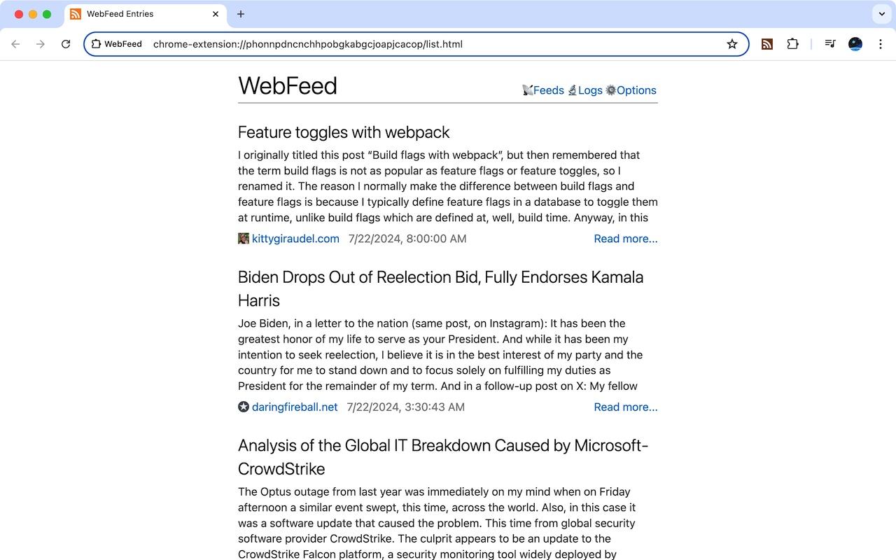

# WebFeed

Simple web feed reader extension for Chrome.

Implemented in pure javascript and only running in browser side, WebFeed can
be used to find and subscribe RSS/Atom web feed. All new posts founded will be
organized into one feed stream.

More details can be found in this blog post[^post].

[^post]: <https://taoshu.in/webfeed/turn-browser-into-feed-reader.html>

You can install WebFeed from Chrome Web Store[^chrome].

[^chrome]: <https://chrome.google.com/webstore/detail/webfeed/phonnpdncnchhpobgkabgcjoapjcacop/>

